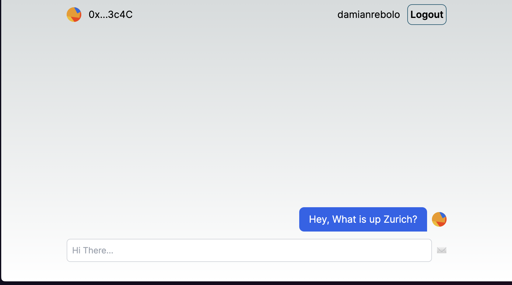
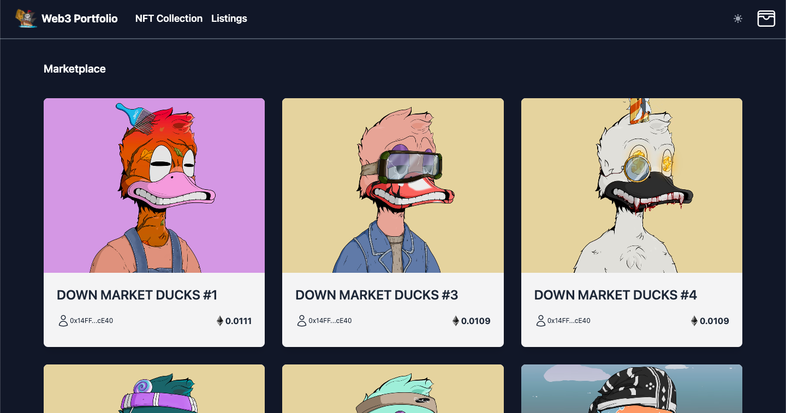
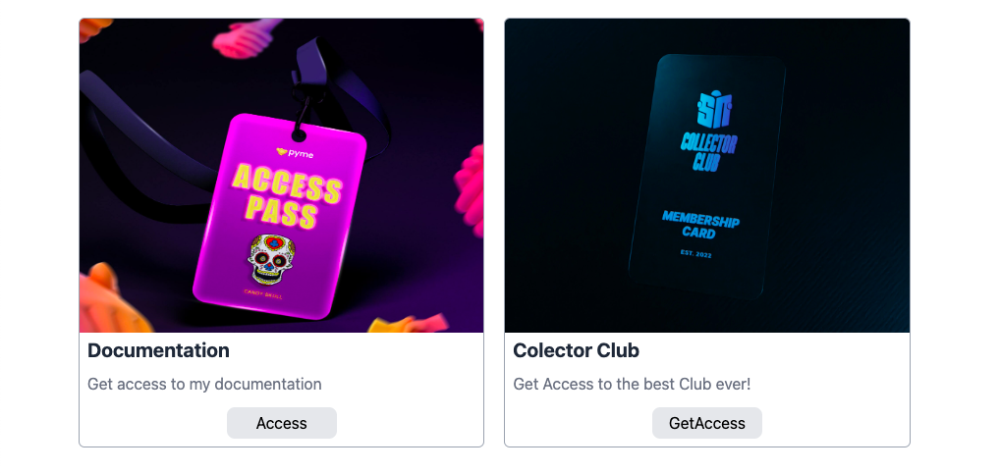
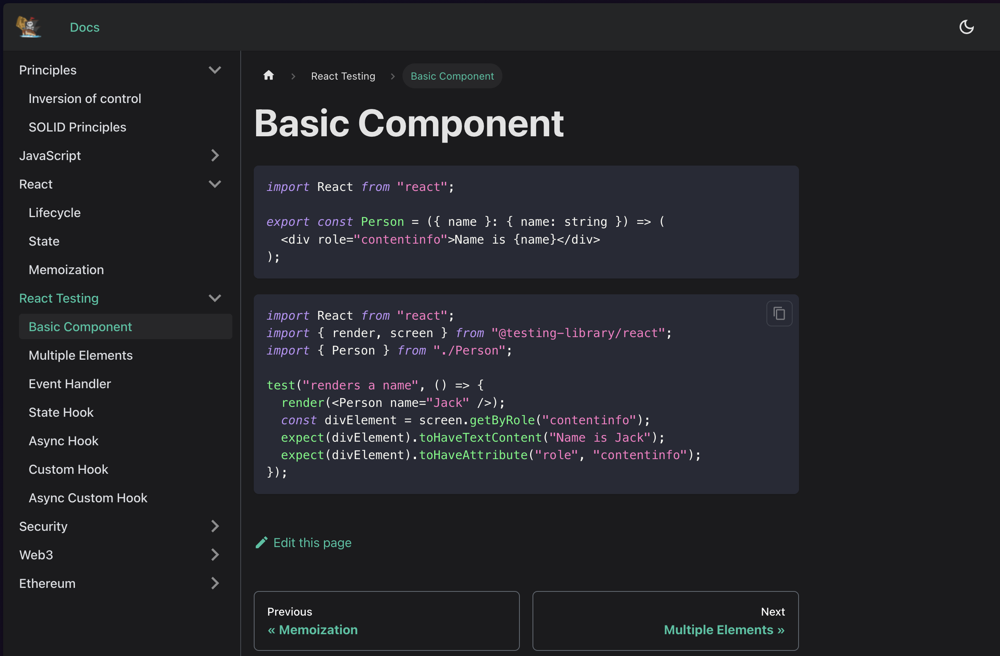
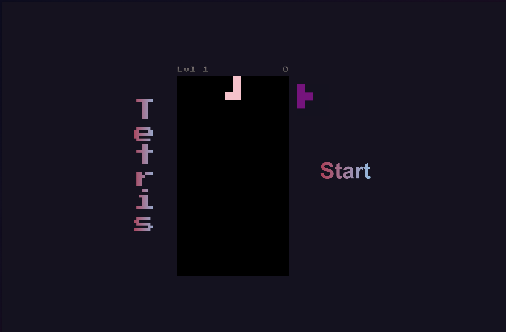

# Web3 Engineer

I'm Damian, a dedicated Frontend Engineer, Architect, and Advisor with a passion for Web3 technologies and blockchain. Here you will find a collection of my work, including open-source contributions, personal projects, and collaborative efforts in the realm of decentralized applications.

## About Me

- **💼 Frontend Engineer**: Crafting user-friendly and responsive interfaces using React, Next.js, Tailwind and more.
- **🧠 Frontend Architect**: Designing scalable and maintainable frontend architectures.
- **👨‍🏫 Frontend Advisor**: Providing guidance and advice on best practices and cutting-edge technologies in Web3.
- **📈 Passionate about**: Stock market, crypto, and the economy.

## Get in Touch

Feel free to reach out to me for collaboration, questions, or just to say hi!

- **Email**: [damianrebolo@gmail.com](mailto:damianrebolo@gmail.com)
- **LinkedIn**: [damianrebolo](https://linkedin.com/in/damianrebolo)

## Featured Projects

### Decentralized Chat App

A decentralized chat app solution with account abstraction and sponsored gas fee.

- [Repository Link](https://github.com/damianrebolo/chatter)
- [LINK TO WEB](https://chatter-dr.vercel.app/)
  

### NFT Marketplace

A marketplace for creating, buying, and selling NFTs. Integrated with Ethereum blockchain.

- [Repository Link](https://github.com/damianrebolo/web3-marketplace)
  

### Decentralized Membership Access

A Membership App where the users can get access to content base on the it needs.

- [Repository Link](https://github.com/damianrebolo/web3-membership)
  

### Personal Docs

A personal documentation website using github pages

- [Repository Link](https://github.com/damianrebolo/my-docu)
- [LINK TO WEB](https://damianrebolo.github.io/my-docu/docs/basic-component)
  

### Tetris Game interview

A tetris game interview challange

- [Repository Link](https://github.com/damianrebolo/tetris)
- [LINK TO WEB](https://damianrebolo.github.io/tetris)
  
